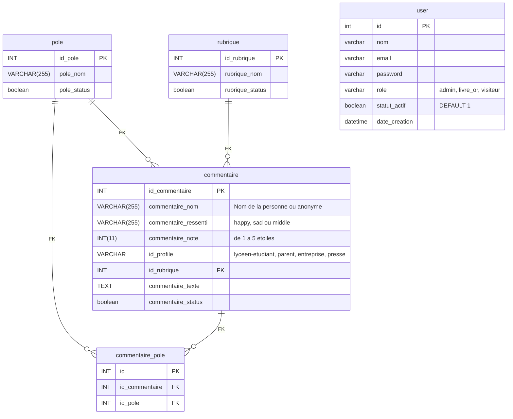

```mermaid
erDiagram

    pole ||--o{ commentaire : "FK"
    pole ||--o{ commentaire_pole : "FK"
    rubrique ||--o{ commentaire : "FK"
    commentaire ||--o{ commentaire_pole : "FK"

    user {

        int id PK
        varchar nom
        varchar email
        varchar password
        varchar role "admin, livre_or, visiteur"
        boolean statut_actif "DEFAULT 1"
        datetime date_creation
    }

    pole {
        INT id_pole PK
        VARCHAR(255) pole_nom
        boolean pole_status
    }

    rubrique {
        INT id_rubrique PK
        VARCHAR(255) rubrique_nom
        boolean rubrique_status
    }

    commentaire {
        INT id_commentaire PK
        VARCHAR(255) commentaire_nom "Nom de la personne ou anonyme"
        VARCHAR(255) commentaire_ressenti "happy, sad ou middle"
        INT(11) commentaire_note "de 1 a 5 etoiles"
        VARCHAR id_profile "lyceen-etudiant, parent, entreprise, presse"
        INT id_rubrique FK
        TEXT commentaire_texte
        boolean commentaire_status
    }

    commentaire_pole {
        INT id PK
        INT id_commentaire FK
        INT id_pole FK
    }
```
